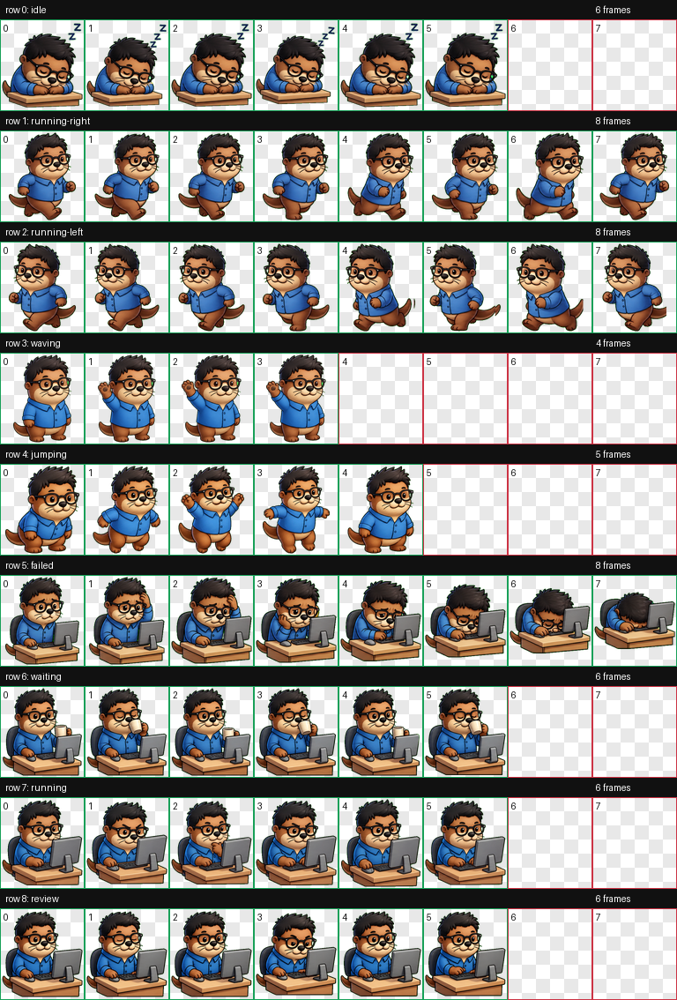

# Desk Otter Codex Pet

A cute desk-worker otter pet for Codex, based on a sticker-style character with black glasses, fluffy hair, a blue shirt, and a computer desk.



## States

- `idle`: sleeping on the desk with small ZZZ marks.
- `running-right`: moving right.
- `running-left`: moving left.
- `waving`: friendly wave.
- `jumping`: small hop.
- `failed`: task failed, slumping at the computer.
- `waiting`: multitasking with coffee.
- `running`: focused computer work.
- `review`: reviewing at the computer, based on the original uploaded sticker composition with the speech bubble removed.

## Install

Copy this folder into your Codex pets directory:

```powershell
Copy-Item -Recurse -Force . "$env:USERPROFILE\.codex\pets\desk-otter"
```

The required files are:

- `pet.json`
- `spritesheet.webp`

## Preview GIFs

The `previews/` folder contains one GIF per animation state.

## Validation

The spritesheet is `1536x1872`, uses `192x208` cells, and passed hatch-pet validation with no errors or warnings.
